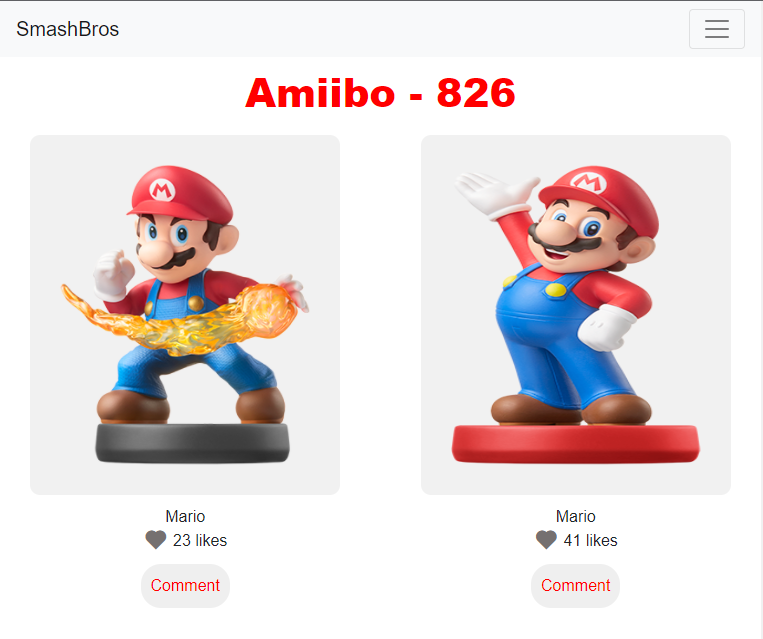

# Pokedex
A simple web app that shows details concerning different Amiibo. Built using HTML,CSS, and JavaScript. Users view a list of amiibo and have the possibility to like and comment on their favorite amiibo.

## Video presentation
* [Video](https://github.com/RayhanTabase/Pokedex/pull/30)

## Screenshots


## Built With

- HTML, JavaScript(ES6), CSS
- Webpack
- Tools used - Git(version control), WebHint(linting tool), Stylelint(style linting), ESLint(Javascript linting)

## Live Demo
* [Demo link](https://rayhantabase.github.io/Pokedex/)

## Software Requirements
* Node.JS
* npm
* Code Editor
* Git

## Installation
* Clone the repo using the command below

```
git clone git@github.com:RayhanTabase/Pokedex.git
```

* Navigate to the directory in which you cloned the project and use the command below

```
cd Pokedex
```

* Install all project dependencies and packages using the command below

```
npm install
```

* Build the project using the command below

```
npm run build
```

* Start the server to run the application locally using the command below

```
npm start
```

## Testing
* Install the repo using the instructions above

* Navigate to the directory in which you cloned the project and use the command below

```
cd Pokedex
```

* Enter the command below to test

```
npm test
```

## Authors

👤 **Salim Abdulai**

- GitHub: [@RayhanTabase](https://github.com/RayhanTabase)
- Twitter: [@RayhanTabase](https://twitter.com/@RayhanTabase)
- LinkedIn: [Salim-Abdulai](https://linkedin.com/in/salim-abdulai-5430065b)
- Email: salimabdulai2@yahoo.com

👤 **Charles Gobina**

* Github:https://github.com/charlesgobina 
* Twitter:https://twitter.com/i4mCloud
* LinkedIn:https://www.linkedin.com/in/charles-gobina-74a0ab193/
* Email: charles.gobina@gmail.com

## 🤝 Contributing

Contributions, issues, and feature requests are welcome!

Feel free to check the [issues page](../../issues/).

* Fork this repo using the command below

```
gh repo fork git@github.com:RayhanTabase/Pokedex.git
```
* Clone the forked repo using the command below

```
git clone git@github.com:RayhanTabase/Pokedex.git
```

* Navigate to the directory in which you cloned the project and use the command below

```
cd Pokedex
```

* Create a new feature branch using the command below

```
git checkout -b [name_of_feature_branch]
```

* Commit your changes using git commit as shown below

```
git commit -m ["enter a commit message"]
```

* Push your changes using

```
git push -u origin [name_of_feature_branch]
```
* Open pull request.

## Show your support

Give a ⭐️ if you like this project!

## 📝 License

This project is [MIT](./MIT.md) licensed.
